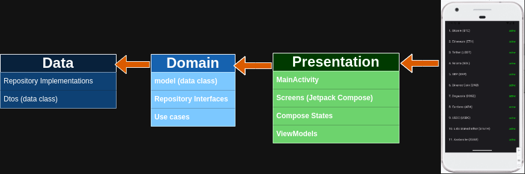
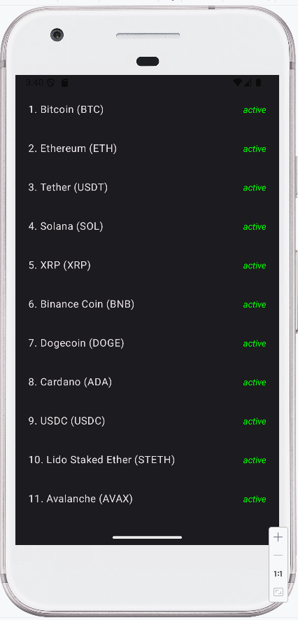

# CryptoCurrencyAppCleanArchicteture
## A Sample Android Kotlin Project Using Android Clean Architecture

* Clean Architecture
* Use Cases
* Compose
* Compose Navigations
* UiState
* Hilt
* Dto

 
 

### References:
 * https://www.youtube.com/watch?v=EF33KmyprEQ
 * https://developer.android.com/topic/architecture
